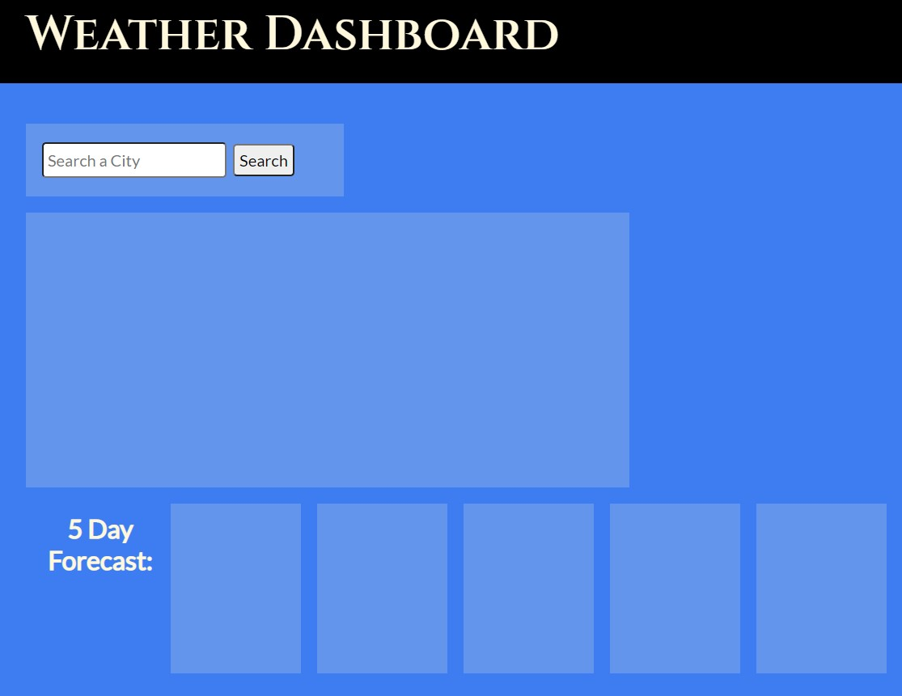
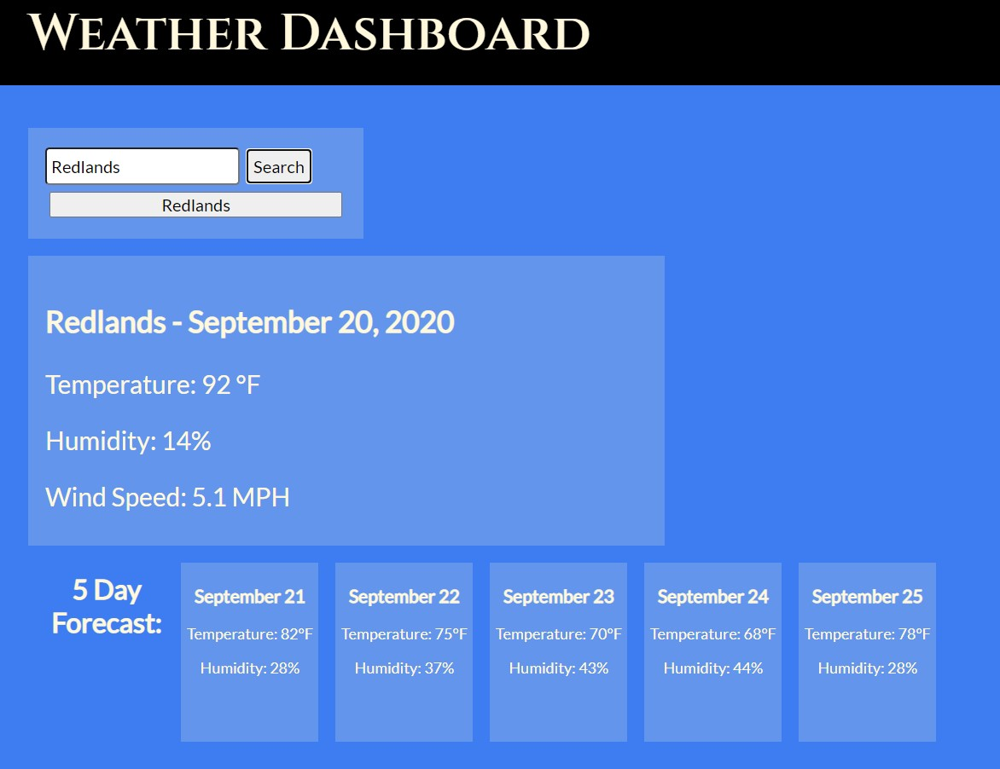

# Weather App
In this application, as a user you will be able to see the weather for any
given city.

[Link to the webpage!](https://codymu45.github.io/weather_app/)

## Home Page

Upon launch, you will find a dashboard ready to display information regarding the weather. To show the weather of any given city, simply type in the name of that city in the search bar and hit the search button.

## Results

After typing in your local city and hitting the search button, you will find the website will display the current date's weather as well as the five day forecast. 

